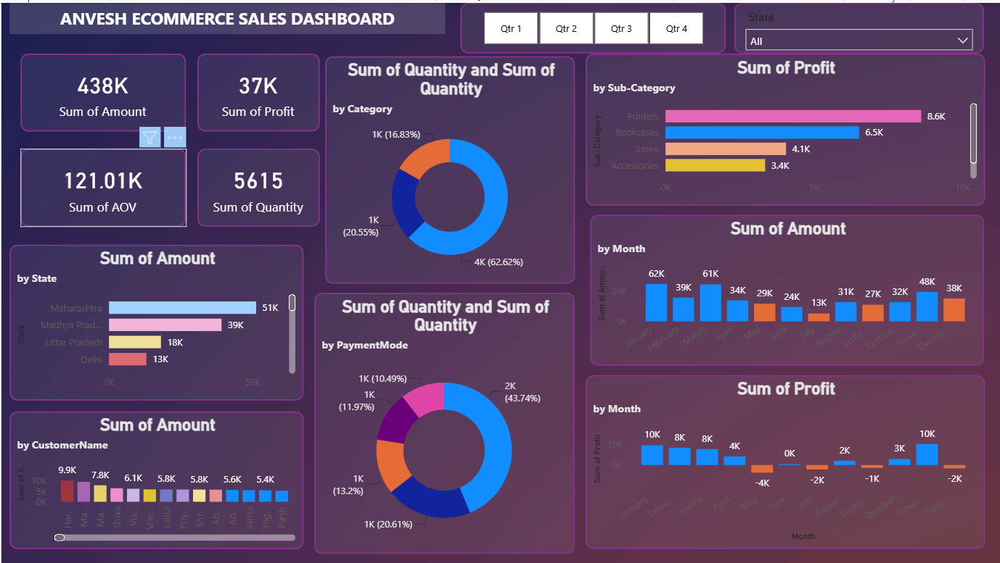

# E-Commerce Sales Performance Dashboard

## Project Overview
This project analyzes online e-commerce sales data to track profitability, customer purchasing behavior, and regional performance. 

## Dashboard View

## Key Insights
* Tracked overall sales performance, totaling 438K in sales amount and 37K in profit.
* Identified top-performing states and individual customers driving the highest revenue.
* Analyzed purchasing behavior by breaking down sales quantities across product categories (Clothing, Electronics, Furniture) and payment modes (COD, UPI, Cards).
* Visualized monthly trends in both total sales amount and net profit.

## Tools Used
* **Power BI:** Data visualization, DAX measures, and interactive dashboard creation.
* **Power Query:** Data cleaning, formatting, and transformation.
